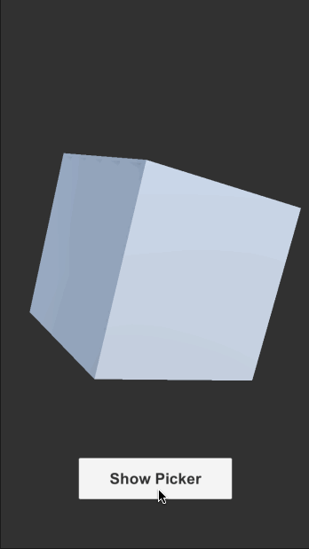
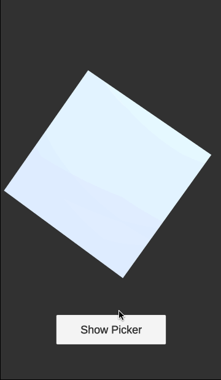

# unimgpicker-plus
Image picker for Unity iOS / Android / StandAlone (Windows, Intel Mac, Linux)
- ReadMe(English)
- [ReadMe(日本語)](README_JP.md)




## Difference from [original unimgpicker](https://github.com/thedoritos/unimgpicker)
There are a number of minor changes, but the following two points are the most significant differences.
- Native image compression support (iOS, Android)
- Support for Windows, Mac(Intel), Linux

<br>

## Getting Started

Import `unimgpicker.unitypackage` into your project.

Define Photo Library Usage Description on `Unimgpicker/Editor/NSPhotoLibraryUsageDescription.txt`

ex: **Unimgpicker/Editor/NSPhotoLibraryUsageDescription.txt**

```
Use the image to create your profile.
```

## Demo

Read image, create texture and render it on the Cube(MeshRenderer).

```csharp
using UnityEngine;
using System.Collections;

namespace Kakera
{
    public class PickerController : MonoBehaviour
    {
        [SerializeField]
        private Unimgpicker imagePicker;

        [SerializeField]
        private MeshRenderer imageRenderer;

        void Awake()
        {
            // Unimgpicker returns the image file path.
            imagePicker.Completed += (string path) =>
            {
                StartCoroutine(LoadImage(path, imageRenderer));
            };
        }

        public void OnPressShowPicker()
        {
            // With v1.1 or greater, you can set the maximum size of the image
            // to save the memory usage.
            imagePicker.Show("Select Image", "unimgpicker", 1024);
        }

        private IEnumerator LoadImage(string path, MeshRenderer output)
        {
            var url = "file://" + path;
            var www = new WWW(url);
            yield return www;

            var texture = www.texture;
            if (texture == null)
            {
                Debug.LogError("Failed to load texture url:" + url);
            }

            output.material.mainTexture = texture;
        }
    }
}
```

## Environment

The code is developed on following environments. Note that these are NOT minimum version requirements.

| Platform | OS |  IDE |
| --- | --- | --- |
| iOS | 13.3 | Xcode 11.6 |
| Android | 10.0 (API 29) | Android Studio 4.0.1 |
| Windows | 10 (20H2) | Visual Studio 2019 16.11.2 |


## Building Unimgpicker by Self

This repository contains Android project to develop Unimgpicker.
You can make changes to the code and build your own jar.

```sh
$ unimgpicker_android
$ ./gradlew unityLibrary:Unimgpicker:exportJar
```

<br>

## Special Thanks
We would like to thank @thedoritos for developing the original project and supervising this repository.<br>
・[The original project：unimgpicker](https://github.com/thedoritos/unimgpicker)
